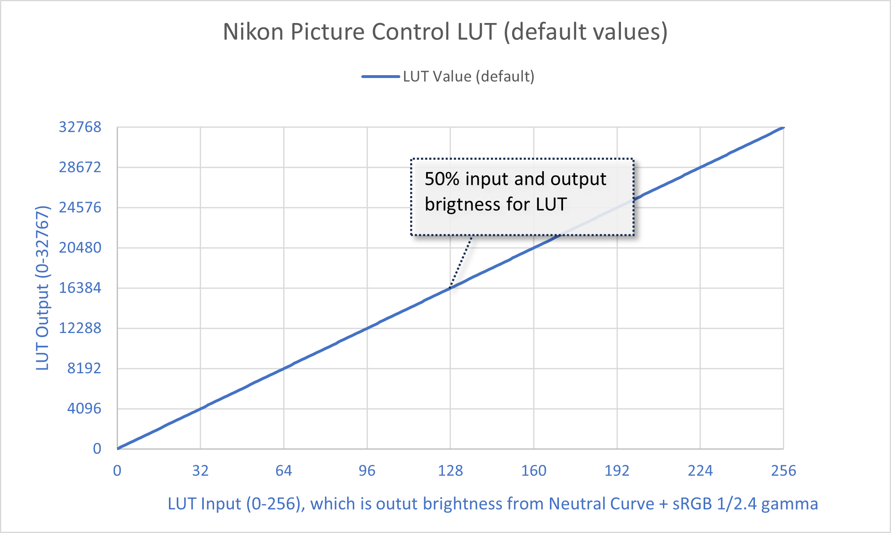
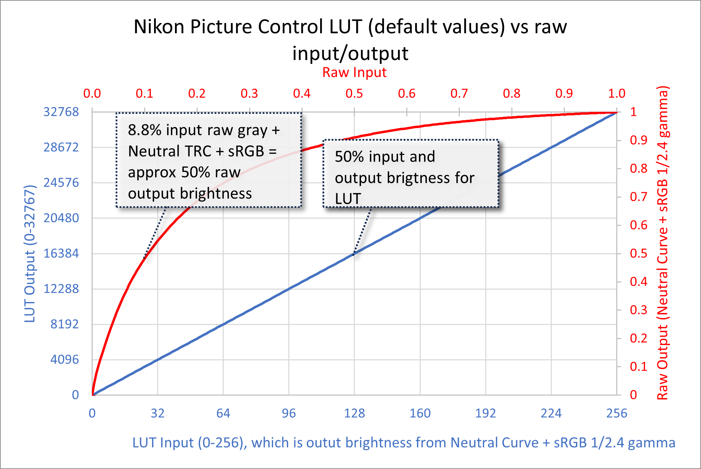

## My Custom Picture Controls
|Name|Purpose|
|--|--|
|[Horshack_Shadow_Highlights.NCP](https://github.com/horshack-dpreview/NikonPictureControlsDev/raw/main/Picture%20Controls/Horshack_Shadow_Highlights.NCP)|Shows clipped highlights as black and clipped shadows as white|
|[Horshack_Invert.NCP](https://github.com/horshack-dpreview/NikonPictureControlsDev/raw/main/Picture%20Controls/Horshack_Invert.NCP)|Inverts all tones, ie shadows become highlights, highlights become shadows, all tones in between swap as well|
|[Horshack_Linear.NCP](https://github.com/horshack-dpreview/NikonPictureControlsDev/raw/main/Picture%20Controls/Horshack_Linear.NCP)|Picture Control with no base Tonal Response Curve, ie "linear"|
|[Horshack_RawLinear.NCP](https://github.com/horshack-dpreview/NikonPictureControlsDev/raw/main/Picture%20Controls/Horshack_RawLinear.NCP)|Same as linear PC but with sRGB 1/2.4 gamma removed as well, ie raw linear values with no perceptual gamma added|
|[Horshack_ISOless_5EV.NCP](https://github.com/horshack-dpreview/NikonPictureControlsDev/raw/main/Picture%20Controls/Horshack_ISOless_5EV.NCP)|Adds 5EV (stops) of exposure to image, for use in ISOless shooting where you're exposing at -5EV during shooting, with intentions for increasing exposure in post (proof-of-concept only - currently keeps highlights blown|

## Nikon Picture Control Curves

Nikon Picture Controls (PC) can have two tone curves:

-   Mandatory: A predefined Tonal Response Curve (TRC), aka "base curve". These are the "Neutral", "Standard", "Vivid", etc.. They are referenced by a PC but not actually included inside them - they are instead embedded in Nikon's camera firmware and Nikon's image processing utilities. A PC establishes which base curve it uses via the base enum field in the .NCP (offset 0x24 in the .NCP). Some values include:
    -   0x0001: STANDARD
    -   0x03C2: NEUTRAL
    -   0x00C3: VIVID
    - See [dumpncp.pl](https://github.com/simeonpilgrim/nikon-firmware-tools/blob/master/nfiles/dumpncp.pl "dumpncp.pl") for a full list
-   Optional: A user-defined curve (UDC), which is implemented as a 257-entry luminosity-only 1D LUT. Users are unaware of this LUT - they instead create their user-defined curves using a curve GUI representation, where they can set up to 20 spline points, which are automatically converted into the LUT by the utility using [cubic spline interpolation](https://en.wikipedia.org/wiki/Spline_interpolation "cubic spline interpolation").

The TRC operates in raw linear space. Its principal responsibility is to shift middle gray from its Nikon-metered 8.8% scene-referred luminance to 18%. It also establishes the basic contrast of the image, which can range from low contrast ("flat" PC) to high contrast ("vivid" PC). 

To produce a JPG, the camera starts with the raw data, after it's been debayered and converted into a colormetric space but before the TRC and gamma (sRGB) have been applied. In other words, a color image in linear raw space. Next the camera applies the TRC. Then the image data is converted into a non-linear gamma color space, sRGB with a 1/2.4 gamma. Here's an animation showing the output of each phase:

Finally, the camera applies the PC settings including the optional UDC. The next section describes how the UDC is defined and applied.

### User-Defined Curve LUT
The user-defined curve is represented by a 257-entry 1D luminosity-only LUT. Unlike the TRC curve, which operates on raw linear image data, the UDC operates on the post-sRGB 1/2.4 gamma data. Both the input and output of the UDC LUT are sRGB 1/2.4 gamma, ie non-linear. This presents a challenge if we want to create a UDC that has a specific mathematical transform, such as a log profile LUT, or a LUT with EV-accurate brightness adjustments such as ISOless preview LUTs. The solution is to perform the LUT adjustments in linear space, converting from sRGB -> Linear before the adjustments and back to sRGB after.

Here's a representation of a "blank" LUT, where the input and output brightness are equal. The x-axis represents the input brightness and the y-axis the output brightness. 

Note that both the input LUT index (0-256) and output LUT value (0-32,767) represent brightness levels, just at different scales. 

 - The input LUT partitions the full range of input brightness into 257 levels, where each LUT index represents a 1/256 increment in brightness, with index #0 representing pure black, index #128 middle gray, and index #256 pure white.  
 - The output LUT partitions the full range of output brightness into 32,768 levels, where value represents a 1/32,767 increment in brightness, with value 0 representing pure black, value 16,384 middle gray, and value 32,767 pure white. Note that the values are contained in 16-bit fields but only 15-bits are actually used.
 - You can convert an input LUT brightness index to an output LUT value via the formula `input * 32727/256`, rounded to the nearest integer. Due to the non-integral division, all output values > 16,384 will be rounded down by -1. For example, an input LUT index of 128*128 = output LUT value 16,384 (0x4000).  while an input LUT index of 129 (0x81) = output LUT value 16,511 (0x407f).
	 - An integer-only version of the formula is `input * 128 - ((input-1)/128)`
 
It's important to understand the relationship between the sRGB 1/2.4 gamma LUT values and the linear raw data which produce it. Here is the same "blank" LUT presented above but with the linear raw input/output curve overlaid, where the output represents the application of both the Neutral TRC and the sRGB 1/2.4 gamma:

The LUT input/output is in blue and raw input/output in red. Note how the 8.8% raw input corresponds to 50% input brightness into the LUT, which for a "blank" LUT also corresponds to 50% output brightness. For example, an 8.8% linear raw value is transformed via the TRC and sRGB 1/2.4 gamma as an output value of 50%, which becomes the 50% input value in the LUT. The output value of the LUT is also in sRGB 1/2.4 gamma. That means any values you change to the LUT will be non-linear, since they represent the output of a gamma curve. For example, adding a fixed value to all 257 output LUT values will not increase the brightness evenly across the full tonal range but instead increase the brightness non-linearly, with the shadows receiving a greater boost than the midtones and highlights. The LUT is effectively like working with an sRGB image in Photoshop but without the benefit of colorspace-aware tools.

In order to perform mathematically-accurate custom LUTs we must first convert the input values from sRGB 1/2.4 gamma into linear light, perform our desired transformation, then convert the result back to sRGB 1/2.4 gamma to generate the final LUT values. For example, if we want to add 1EV of brightness evenly across all tones the steps would be: 

 1. sRGB 1/2.4 LUT value -> Linear Light
 2. Linear Light * 2
 3. Linear Light -> sRGB 1/2.4 LUT value

Additionally, if we want to perform a transform that excludes the TRC already included in the LUT value we must add a step that removes it prior to our transform:

 1. sRGB 1/2.4 LUT value -> Linear Light
 2. Apply inverse of Nikon Neutral TRC (in linear space), to remove the TRC
 3. Linear Light * 2
 4. Optionally add Nikon Neutral TRC back into the LUT value
 5. Linear Light -> sRGB 1/2.4 LUT value
 
Here is a graph of the Neutral TRC, sRGB 1/2.4, and both (plotted in solid lines), along with their inversion curves (plotted in dashed lines). Note that I'm presently using Adobe's camera-matching Neutral curve in place of Nikon's actual Neutral curve because Nikon's curve is not published and must be reversed engineered (on my to-do list):

### Tools
This repository includes a spreadsheet that performs these calculations for you. You can simply add columns to the existing sheet to perform your desired transform. The sheet will generate the actual LUT output hex values as the final step. For example, here's the tab that performs an ISOless +5EV push: 

### Issues
#### Nikon's application of LUT changes saturation
When Nikon applies the User-Defined Curve it does so in a manner that doesn't preserve saturation. As a result, any UDC that lowers the brightness will cause saturation to be increased, whereas UDC's that increase brightness cause saturation to be decreased. This is not unique to our direct modification of the LUT - it also occurs for curve's created using Nikon's own utilities.

Ideally we would want the LUT to be applied to luminosity only, via a formula such as `New_LUT_Value/Old_LUT_Value` applied/scaled to each of the RGB values. What Nikon appears to be doing instead is calculating the luminance from the weighted RGB values and applying the LUT delta in that weighted space, which causes the saturation to be changed.

## Credits
Special thanks to the following individuals:

 - [Jim Kasson](https://blog.kasson.com/)
 - [Bill Claff](https://www.photonstophotos.net/)
 - [Iliah Borg](https://www.rawdigger.com/)
 - [Jack Hogan](https://www.strollswithmydog.com/)

